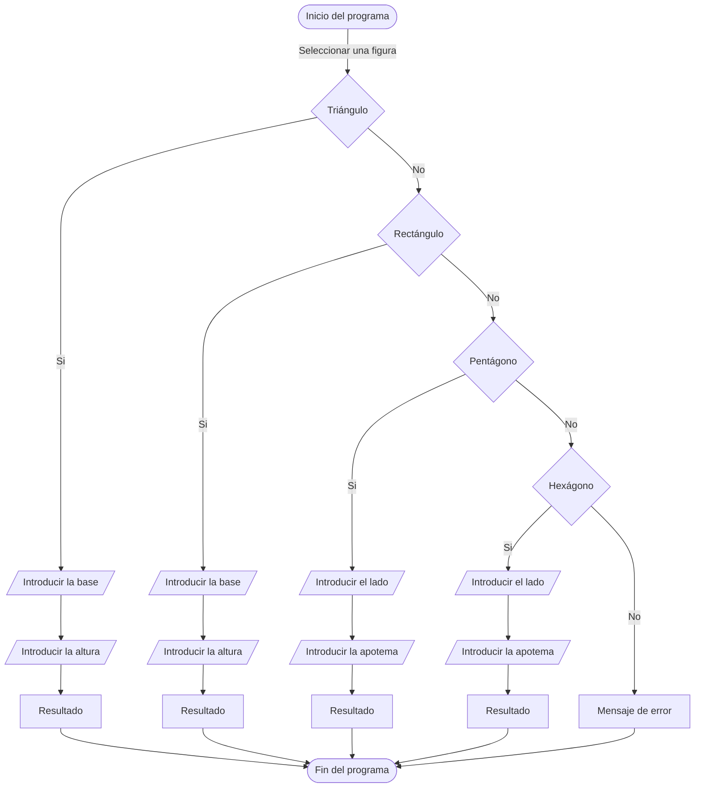

# Ejercicios semana 4

## [Ejercicio 1](src/com/ejercicios/Ejercicio1.java)
Crea un programa que muestre por pantalla si un número introducido por el
usuario es mayor o menor que 10.

## [Ejercicio 2](src/com/ejercicios/Ejercicio2.java)
Crea un programa que muestre por pantalla si una palabra que introduzca el
usuario contiene la letra b minúscula.
>Pista: “variable”.contains(“texto”);

## [Ejercicio 3](src/com/ejercicios/Ejercicio3.java)
Crea un programa que muestre por pantalla una selección de productos al
usuario (3 o 4) y dependiendo de lo que escriba el usuario, se muestre el
precio del producto.
```
Ej.: 
Leche
Cacao
Avellanas
Azucar
“Cacao”
El cacao vale 2 €
```

## [Ejercicio 4](src/com/ejercicios/Ejercicio4.java)
Crea un programa que muestre por pantalla distintas figuras geométricas
(triángulo, rectángulo, pentágono y hexágono). Según lo que escoja el
usuario, se le pedirá que introduzca unos valores clave para calcular el área
de la figura seleccionada. Mostrar por pantalla el resultado.



## [Ejercicio 5](src/com/ejercicios/Ejercicio5.java)
Crea un programa que pida una frase al usuario y comprueba si en esa frase
contiene alguna b o v. Si existe una b, buscar si tiene alguna p la frase. Si
tiene v, buscar si tiene u. Estas cláusulas no son excluyentes. Mostrar por
pantalla si son ciertos todos los casos.
>Pista: Se pueden concatenar múltiples operaciones lógicas. Ej: (A & B) & (C &
D)

## [Ejercicio 6](src/com/ejercicios/Ejercicio6.java)
Crea un programa que calcule si un número dado por el usuario es par o
impar y lo muestre por pantalla.
>Pista: El módulo o resto de la división indica si un número es par o no.

## [Ejercicio 7](src/com/ejercicios/Ejercicio7.java)
Crea un programa que pida una cadena de texto al usuario. Calcular si la
cadena contiene un número de caracteres par o impar y mostrarlo por
pantalla.
>Pista: Las cadenas de texto tienen la propiedad .length que devuelve el
tamaño.